# Features

### Social Media Identity Registrar (SMIR):
- Ability to create and register unique decentralized identifiers (DIDs).
Provide interfaces for identity owners to manage their credentials.
Implement policies and rules for access control based on user actions.

### Broadcast Authenticator:
- Generate cryptographic signatures for content to attest to its origin.
Validate identities against posted content to prevent impersonation and fake news.
Provide a trust metric for content based on the authenticity of the source.

### Signature Validator:
- Check signatures on content to confirm its authenticity.
Maintain a database of public keys to be used in the verification of signatures.
Interface seamlessly with client-side applications for real-time verification.

### Key Protection Service:
- Securely manage private keys used for signing content.
Incorporate multi-factor authentication mechanisms (e.g., U2F keys, biometrics).
Ensure high-security standards for key storage, comparable to Skiff-standard security.

### Authority Role Identifier:
- Associate specific keys with individual organizational roles for differentiated access.
Notify relevant parties to authorize actions through multisig protocols.
Define policies for key use within an organization.

### Insider Threat Mitigator:
- Monitor for unauthorized internal access to sensitive systems.
Implement strict access control systems to mitigate risks from privileged users.
Enforce security protocols and audit trails for all access and actions taken.

### Blockchain DID Registrar (BDR):
- Record and maintain DID records on a blockchain for an immutable history.
Facilitate the verification of identities through a distributed ledger.
Provide APIs for accessing and cross-referencing blockchain-based DIDs.

### (User) Access Control Programmer:
- Enable individual users to define their access control settings.
Allow integration of hardware devices for secure authentication.
Support for adding varied cryptographic credentials, like X.509 or PGP keys.

### Content Authenticator (for companies like Twitter):
- Develop systems for vetting and linking content to verified identities.
Construct frameworks for endorsers to vouch for the credibility of content.
Use veracity bonds as an economic model to incentivize truthfulness in sharing content.

